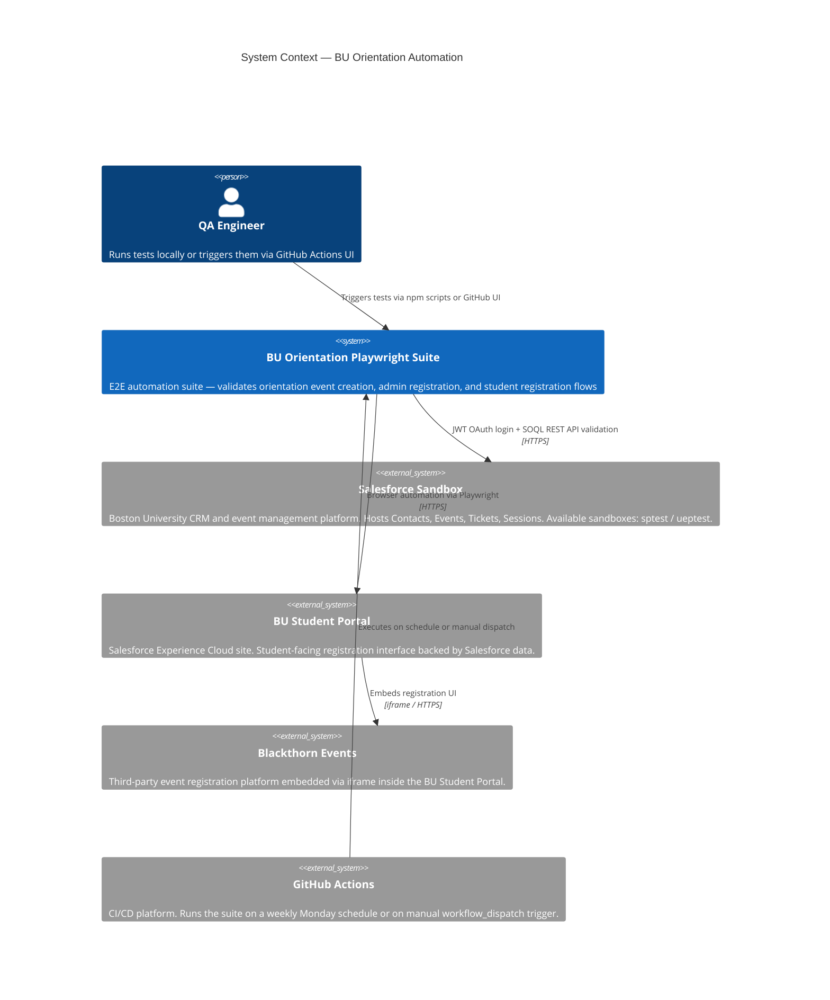
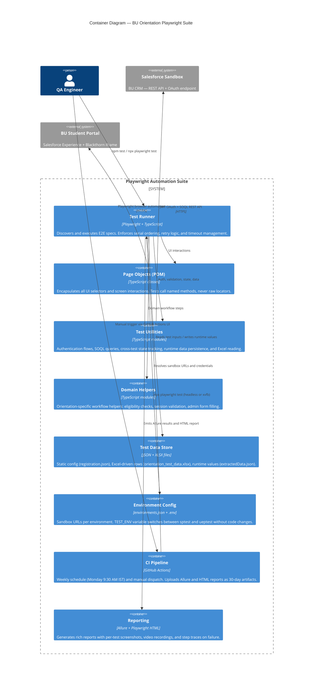
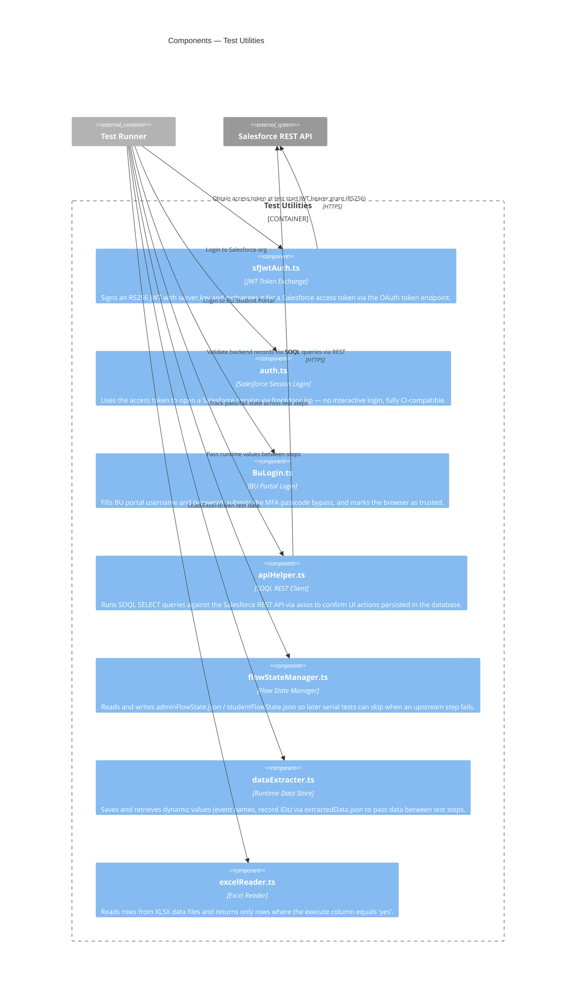
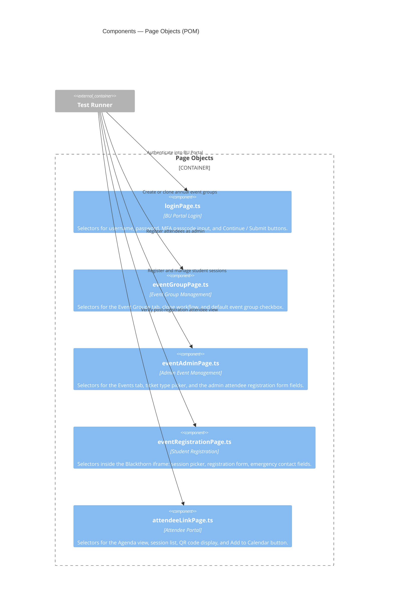
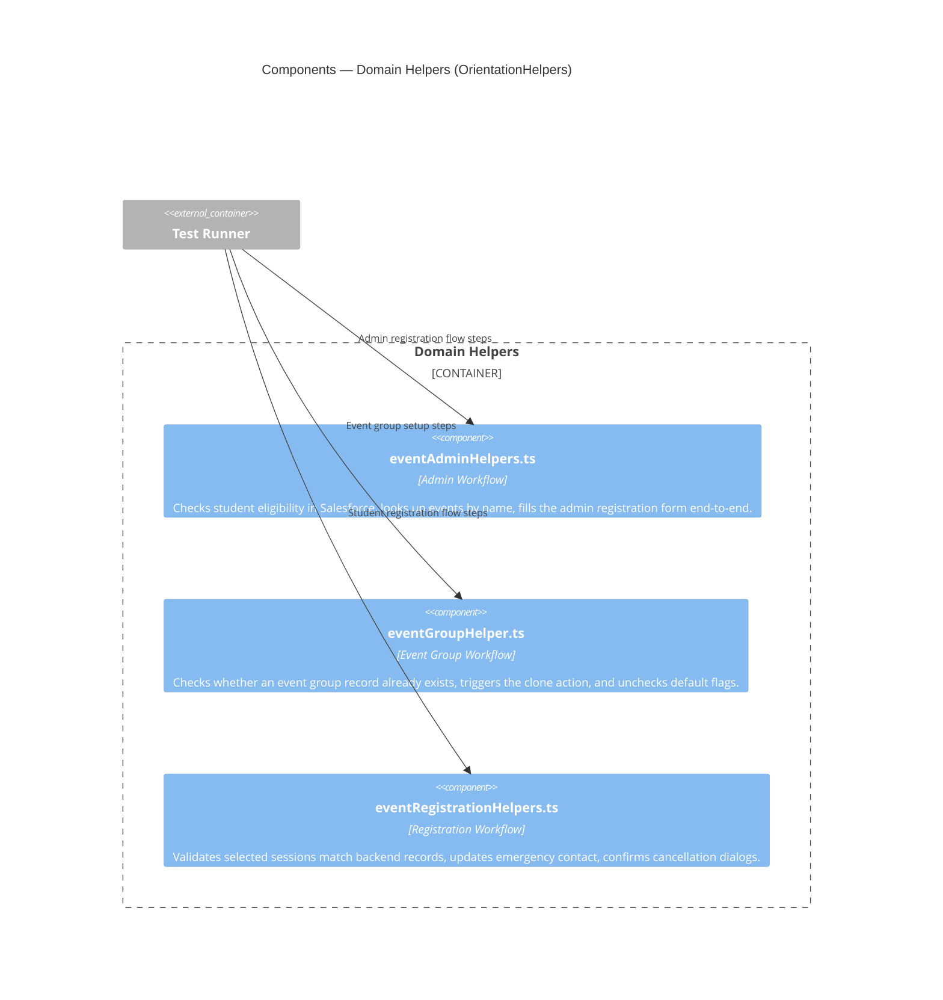

# BU Orientation Events — Playwright Automation Suite

End-to-end test automation for Boston University's Orientation Events registration system built on Salesforce. Covers admin registration workflows, student-facing registration, event group management, and backend validation via SOQL.

---

## Table of Contents

- [C1: System Context](#c1-system-context)
- [C2: Container Diagram](#c2-container-diagram)
- [C3: Component Diagrams](#c3-component-diagrams)
- [Tech Stack](#tech-stack)
- [Project Structure](#project-structure)
- [Prerequisites](#prerequisites)
- [Setup](#setup)
- [Environment Configuration](#environment-configuration)
- [Running Tests](#running-tests)
- [Test Reports](#test-reports)
- [CI/CD](#cicd)

---

## C1: System Context

> Who interacts with the system and what external systems does it depend on?



---

## C2: Container Diagram

> What are the major deployable/runnable units inside the suite and how do they interact?



---

## C3: Component Diagrams

> What are the key components inside each container?

### Test Utilities



### Page Objects



### Domain Helpers



---

## Tech Stack

| Tool | Version | Purpose |
|---|---|---|
| [Playwright](https://playwright.dev) | ^1.58.2 | E2E browser automation |
| TypeScript | ^6.0.2 | Type-safe test authoring |
| [Allure](https://allurereport.org) | ^2.30.0 | Rich test reporting |
| [jsonwebtoken](https://github.com/auth0/node-jsonwebtoken) | ^9.0.3 | Salesforce JWT OAuth flow |
| axios | ^1.17.0 | SOQL REST API queries |
| xlsx | ^0.18.5 | Excel test data reader |
| dotenv | ^17.4.2 | Environment variable management |

---

## Project Structure

```
Projects/
├── .github/workflows/
│   └── playwright.yml                      # GitHub Actions CI/CD pipeline
├── config/
│   └── environments.json                   # Sandbox URLs per environment
├── pages/                                  # Page Object Model
│   ├── loginPage.ts
│   └── orientationEvents/
│       ├── attendeeLinkPage.ts
│       ├── eventAdminPage.ts
│       ├── eventGroupPage.ts
│       └── eventRegistrationPage.ts
├── tests/
│   └── orientationSmoke/
│       ├── orientationAdmin.spec.ts         # Admin registration (4 serial tests)
│       ├── orientationEvent.spec.ts         # Event group creation/clone (1 test)
│       └── orientationRegistration.spec.ts  # Student registration (6 serial tests)
├── utils/
│   ├── auth.ts                             # Salesforce frontdoor.jsp login
│   ├── authUtils.ts                        # Session validation utilities
│   ├── sfJwtAuth.ts                        # JWT token generation and exchange
│   ├── BuLogin.ts                          # BU portal login with MFA bypass
│   ├── apiHelper.ts                        # SOQL REST API client
│   ├── flowStateManager.ts                 # Cross-test pass/fail state
│   ├── dataExtracter.ts                    # Runtime JSON data persistence
│   ├── excelReader.ts                      # Excel test data reader
│   └── OrientationHelpers/
│       ├── eventAdminHelpers.ts
│       ├── eventGroupHelper.ts
│       └── eventRegistrationHelpers.ts
├── data/
│   ├── registration.json                   # Static test configuration
│   ├── orientation_test_data.xlsx           # Excel-driven test data
│   └── extractedData.json                  # Runtime values passed between tests
├── adminFlowState.json                     # Runtime: admin test pass/fail state
├── studentFlowState.json                   # Runtime: student test pass/fail state
├── server.key                              # Salesforce private key (NOT committed)
├── playwright.config.ts
├── tsconfig.json
└── package.json
```

---

## Prerequisites

| Tool | Version | Notes |
|------|---------|-------|
| Node.js | 18+ LTS | [nodejs.org](https://nodejs.org) |
| Java JDK | 11+ | Required by Allure CLI — [adoptium.net](https://adoptium.net) |
| Git | latest | [git-scm.com](https://git-scm.com) |

You will also need:
- Access to a BU Salesforce sandbox (`sptest` or `ueptest`)
- A Salesforce Connected App configured for JWT Bearer OAuth
- BU portal credentials with a valid MFA passcode

---

## Setup

```bash
# 1. Clone the repository
git clone <repo-url>
cd "PlayWright Automation/Projects"

# 2. Install dependencies
npm ci

# 3. Install Playwright browsers
npx playwright install

# 4. Configure environment variables
cp .env.example .env
# Edit .env with your credentials (see Environment Configuration below)

# 5. Place the Salesforce Connected App private key
# Copy your RSA private key file to: server.key (project root)
# Do NOT commit this file — it is listed in .gitignore
```

---

## Environment Configuration

The active Salesforce sandbox is selected via the `TEST_ENV` variable. Available values are defined in `config/environments.json`:

| `TEST_ENV` | Salesforce sandbox |
|---|---|
| `sptest` (default) | `bostonuniversity-b--sptest` |
| `ueptest` | `bostonuniversity-b--ueptest` |

Copy `.env.example` to `.env` and fill in all required values:

```env
# Target environment: sptest | ueptest  (defaults to sptest)
TEST_ENV=sptest

# Salesforce JWT OAuth — Connected App credentials
SF_CLIENT_ID=your_connected_app_consumer_key
SF_USERNAME=your_sf_automation_username

# BU Portal credentials
BULoginName=your_bu_login
BUTestPassword=your_bu_password
BUPasscode=your_mfa_passcode
```

> **Never commit `.env` or `server.key`.** Both are in `.gitignore`. The `config/environments.json` file contains only URLs and is safe to commit.

---

## Running Tests

```bash
# All tests, headless, default environment
npm test

# Target a specific environment
TEST_ENV=ueptest npx playwright test

# Specific browser in headed mode
npm run test:chromium
npm run test:firefox

# All browsers in headed mode
npm run test:all

# Run tests and auto-generate Allure report
npm run test:allure

# Run a specific spec file
npx playwright test tests/orientationSmoke/orientationAdmin.spec.ts

# Filter tests by title
npx playwright test --grep "Register attendee"
```

---

## Test Reports

### Playwright HTML Report

```bash
npx playwright show-report
```

### Allure Report

```bash
npm run allure:generate    # Build HTML report from raw results
npm run allure:open        # Open the generated report in a browser
npm run allure:serve       # Serve live with auto-refresh

npm run clean:reports      # Delete all report output directories
```

Report output locations:

| Path | Contents |
|---|---|
| `reports/allure-results/` | Raw Allure result files |
| `reports/allure-report/` | Generated Allure HTML report |
| `reports/html-report-<timestamp>/` | Timestamped Playwright HTML report |

---

## CI/CD

Pipeline definition: [.github/workflows/playwright.yml](.github/workflows/playwright.yml)

**Triggers:**
- **Scheduled:** Every Monday at 9:30 AM IST (04:00 UTC) — runs all tests on the default environment
- **Manual (`workflow_dispatch`):** Trigger from the GitHub Actions UI with optional inputs:

| Input | Description | Default |
|---|---|---|
| `spec_file` | Path relative to `tests/` to run a single spec | _(all tests)_ |
| `browser` | `chromium` / `firefox` / `webkit` | `chromium` |
| `headed` | Run in headed mode via xvfb | `false` |

**Required GitHub Secrets:**

| Secret | Description |
|---|---|
| `SF_CLIENT_ID` | Salesforce Connected App consumer key |
| `SF_USERNAME` | Salesforce automation username |
| `BUTESTPASSWORD` | BU portal test user password |
| `BUPASSCODE` | BU portal MFA passcode |

**Pipeline steps:**
1. Checkout code
2. Setup Node.js LTS with npm cache
3. `npm ci` — clean dependency install
4. Install Playwright browser and system dependencies
5. Run tests (headless or headed via xvfb based on input)
6. Generate Allure report from results
7. Upload Allure artifact — named `allure-report-{browser}-{date}-run{number}`, retained 30 days
8. Upload Playwright HTML artifact — retained 30 days
